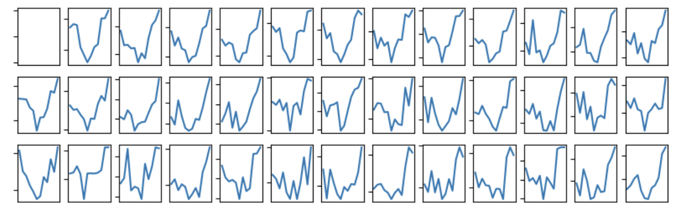
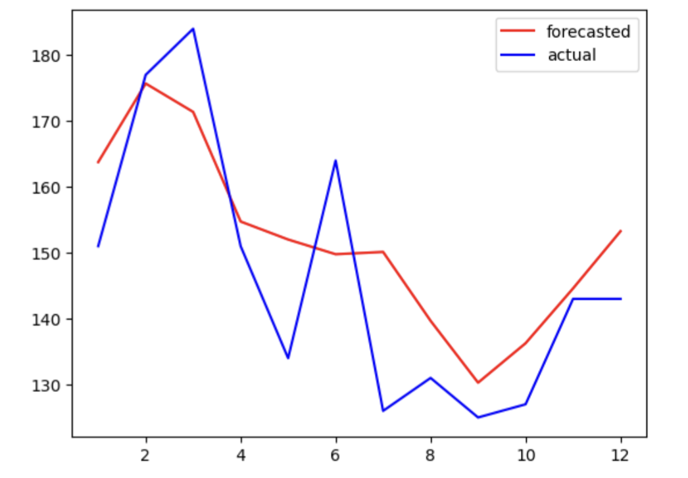
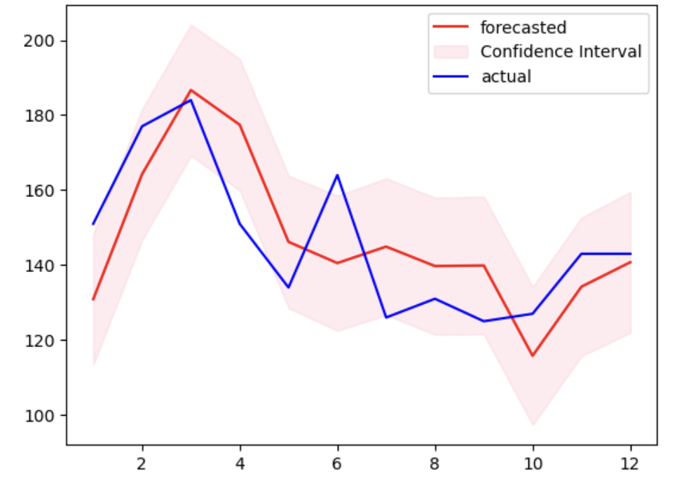

# TimeSeriesAnalysis

Following is the prediction made using auto regressive model on australian beer production:

Since in production their is presence of trend and sesonality, lets us check how SARIMAX model behaves, following are the results:

